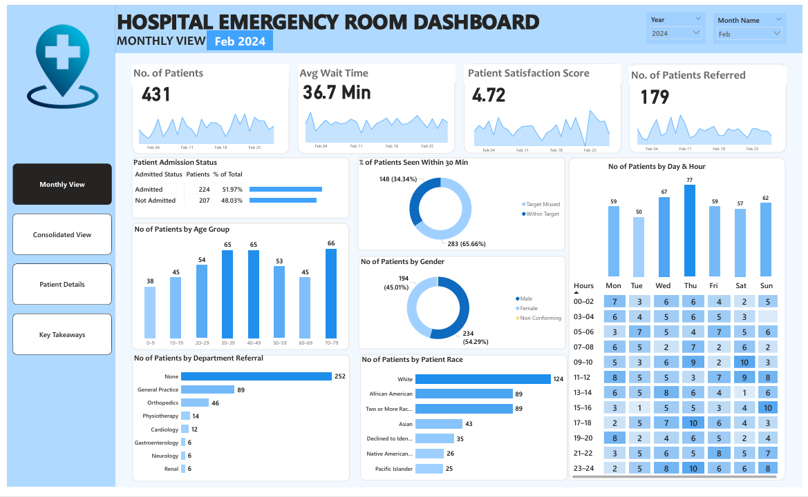

# Hospital-Emergency-Room-Dashboard
This Power BI dashboard provides an in-depth view of Emergency Room (ER) operations, focusing on real-time metrics, patient experience, and departmental trends. Designed to support hospital administrators, clinicians, and data analysts, the dashboard  delivers actionable insights for optimizing ER efficiency, resource allocation, and patient care.

**Power BI Dashboard** : [Interactive Dashboard](https://app.powerbi.com/view?r=eyJrIjoiMzQxMjBiNjQtMTY4NC00OGJlLTkzZDYtMzlkOTA2ZDllMjljIiwidCI6ImM2ZTU0OWIzLTVmNDUtNDAzMi1hYWU5LWQ0MjQ0ZGM1YjJjNCJ9)

**Project Objectives:**
1.	Monthly View: Monitor key metrics on a month-by-month basis to identify trends and improvement areas.
2.	Consolidated View: Provide a comprehensive summary of ER performance over customizable date ranges for broader insights and trend analysis
3.	Patient Details – Deliver granular, patient-level insights for detailed analysis and operational troubleshooting.
4.	Key Takeaways – Summarize insights from all dashboards to highlight patterns, anomalies, and data-driven recommendations.

**Key KPIs:**
1.	Number of Patients
    - Daily count of ER visits.
    - Trend displayed using area sparklines to detect peak days and seasonal fluctuations.
2.	Average Wait Time
    - Measures time before patients are seen by a medical professional.
    - Area sparklines help track fluctuations and identify days with potential delays.
3.	Patient Satisfaction Score
    - Analyzes daily average satisfaction ratings.
    - Highlights dips in satisfaction to uncover service quality issues.
4.	Number of Patients Referred
    - Tracks daily referrals to other hospital departments.
    - Identifies high-demand departments for better resource allocation.

**Additional Features**
1.	Patient Admission Status
        - Categorizes patients as admitted or non-admitted (discharged, referred, or treated as outpatient).
2.	Patient Age Distribution
        - Groups patients into 10-year age intervals to identify demographic patterns.
3.	Department Referrals
        - Analyzes referral trends across departments (e.g., Orthopedics, Cardiology, Pediatrics).
4.	Timeliness
        - Measures the percentage of patients seen within 30 minutes—critical for efficiency.
5.	Gender Analysis
        - Visual breakdown of patients by gender.
6.	Racial Demographics
        - Tracks patient race or ethnicity as self-reported—essential for identifying disparities and ensuring equitable care.
7.	Time Analysis
        - Assesses patient volume by day of the week and hour to optimize staffing and resource planning.

**Tools & Technologies**
- Power BI Desktop – Report development and dashboard creation
- Power Query – Data import, transformation, and cleansing
- DAX (Data Analysis Expressions) – Custom measures, KPIs, and calculated columns

